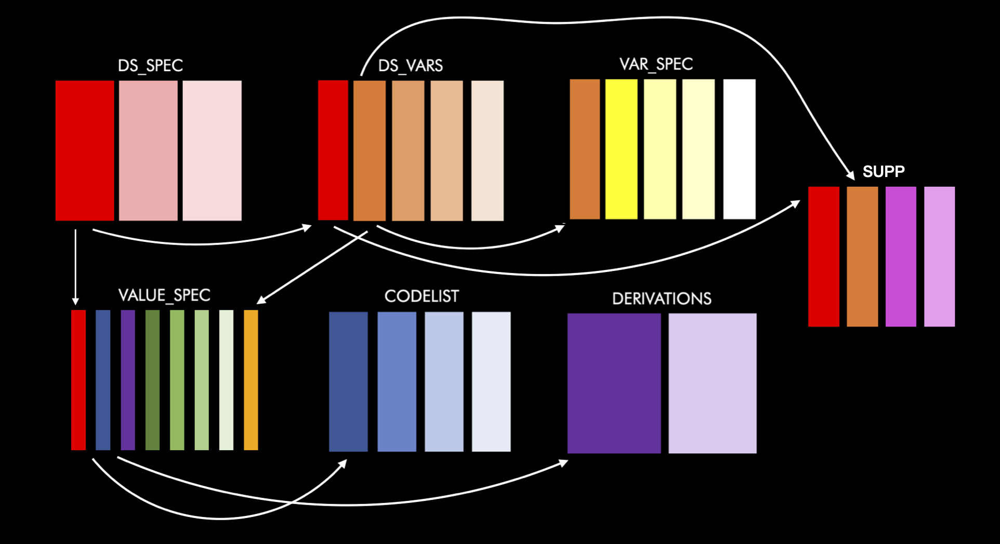

<!-- README.md is generated from README.Rmd. Please edit that file -->

# metacore <a href='https://github.com/atorus-research/metacore'></a>

<!-- badges: start -->

[](https://RValidationHub.slack.com)
[](https://github.com/atorus-research/xportr/actions?workflow=R-CMD-check)
[](https://app.codecov.io/gh/atorus-research/metacore)
[](https://github.com/atorus-research/metacore/blob/master/LICENSE)
[](https://lifecycle.r-lib.org/articles/stages.html#experimental-1)
<!-- badges: end -->

Programming for clinical trial data analysis tends to be very
standardized. With data standards such as
[CDISC](https://www.cdisc.org/), expectations tend to be very clearly
defined. Within these programming activities, there’s ample room for the
use of metadata. Metadata can be used for several different purposes,
such as applying dataset attributes, establishing sort sequences,
working with controlled terminology, and more. Despite CDISC standards,
organizations tend to have their own means of storing metadata, be it in
excel spreadsheets, databases, and more.

The purpose of metacore is to establish a common foundation for the use
of metadata within an R session. This is done by creating an R object
that can hold the necessary data in a standardized, immutable structure
(using R6) that makes it easy to extract out necessary information when
needed. Users can read in their metadata from their various sources. To
make this easy, we’ve provided some helper functions - and even have
readers that can read directly from Define.xml 2.0. By establishing a
common and consistent object in memory, further packages that support
these work flows can have a common foundation upon which tools can be
built that leverage metadata in the future. This reduces the need to
hold different data structures containing metadata and instead allows
programs to pull this information from a centralized source.

## Installation

You can install the current development version of metacore from
[github](https://github.com/atorus-research/metacore) with:

``` r
devtools::install_github("atorus-research/metacore")
```

## Structure

A metacore object is made-up of 6 different tables, which are connected
with a series of identifying columns. The goal of these tables is to
normalize the information as much as possible, while keeping together
like information. Each table has a basic theme to make them easier to
remember. They are as follows:

  - **ds\_spec**: Contains dataset level information

  - **ds\_vars**: Bridges the dataset and variable level information

  - **var\_spec**: Contains variable level information

  - **value\_spec**: Contains value level information

  - **derivations**: Contains all derivations

  - **codelist**: Contains information about code/decodes, permitted
    values and external libraries

Here is a schema of how all this fits together:



### ds\_spec 

This table covers the basic information about each dataset. There is
only a single row per dataset, with the following information:

  - *dataset*: The abbreviated name of the dataset (e.g. AE)

  - *Structure*: Value structure of the dataset as a sting

  - *Label*: Dataset label

### ds\_vars 

This table contains the information that bridges between purely dataset
level and purely variable level. There is one row per dataset per
variable:

  - *dataset*: The abbreviated name of the dataset. This will match to
    the name in **ds\_spec**

  - *variable*: Variable name

  - *key\_seq*: Sequence key, which are the variables used to order a
    dataset. This is a column of integers, where 1 is the first sorting
    variable and 2 is the second etc. If the variable is not used in
    sorting it will be left `NA`

  - *order*: Order sets the order of the columns to appear in the
    dataset. This is also a numeric value

  - *keep*: Logical value about if the variable needs to be kept

  - *core*: ADaM core, which should be one of the following values:
    “Expected”, “Required”, “Permissible”, “Conditionally Required”,
    “Conditionally Expected”, or NA. For more information about core
    see [CDISC](https://www.cdisc.org/standards/foundational/adam)

  - *supp\_flag*: Logical to determine if the variable is in the
    supplemental datasets

### var\_spec 

This table contains the information the purely variable level
information. The goal is there is a single row per variable, which is
common across all datasets. This helps ensure variables follow the CDISC
standard. But, this isn’t always possible, so if information for a given
variable differs across datasets, the variable will be recorded as
dataset.variable in the variable column.

  - *variable*: Variable name, which should match the name in
    **ds\_spec**. Unless the variable needs to be duplicated, then the
    name will be a combination of the the dataset name and variable name
    from **ds\_spec** (dataset.variable)

  - *type*: Variable class

  - *length*: Variable length (while not relevant to R datasets, this is
    important for when creating XPT files)

  - *label*: Variable label

  - *common*: Common across ADaM datasets

  - *format*: Variable format

### value\_spec 

This table contains the information the information at the value level.
There will be at least one row per dataset/variable combination. There
is more than one row per dataset/variable combination if the combination
has values which have differing metadata. For instance LBORRES that are
different data types depending on the value. The information contained
are as follows:

  - *dataset*: The abbreviated name of the dataset. This will match to
    the name in **ds\_spec**

  - *variable*: Variable name. This will match to the name in
    **ds\_vars**

  - *type*: String of the value type

  - *origin*: Origin of the value

  - *code\_id*: ID for the code list to match the id in the **codelist**
    table

  - *where*: Value of the variable

  - *derivation\_id*: ID for the derivation to match with the
    **derivation** table

### derivation 

This table has all the derivation information, with one row per
derivation ID and the following information:

  - *derivation\_id*: The ID, which should match to **value\_spec**

  - *derivation*: Text describing the derivation

### codelist 

This table contains the code lists, permitted value lists, and external
libraries nested within a tibble. There is only a single row per
list/library, with the following information:

  - *code\_id*: the ID used to identify the code list. This should be
    the same as the *code\_id* in **val\_spec**

  - *name*: Name of the code list

  - *code*: A list of tibbles (for code / decode combinations) and
    vectors (for permitted values and libraries), which contain all the
    codes

  - *type*: An indicator of if the information in the code column is a
    code/decode table, permitted value, or external library

To see a metacore object in about please see our vignettes


## Future Development

This is an alpha release of this package, so if you have ideas on future
improvements please add them to the issue log. Additionally we are
looking into creating an additional **changelog** table to track any
changes to metacore objects. This would provide a robust and traceable
solution to changing data requirements.
