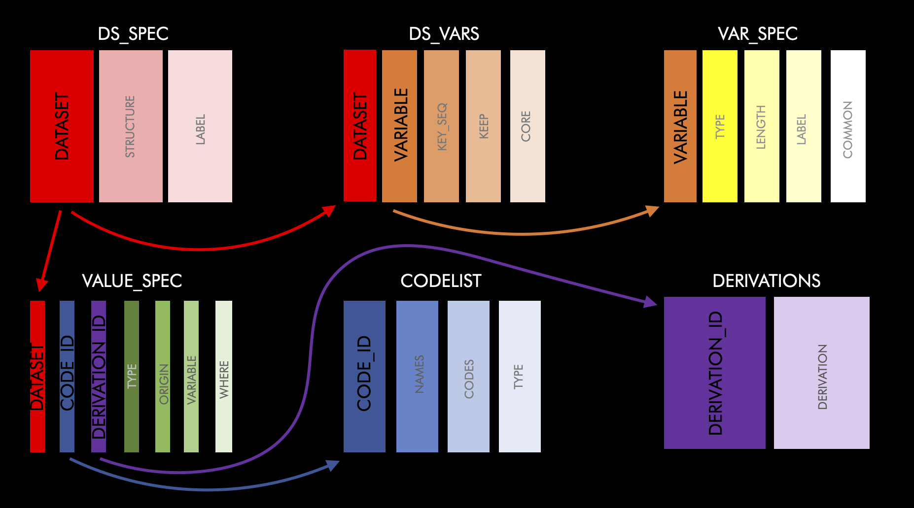

```{r, include = FALSE}
knitr::opts_chunk$set(
  collapse = TRUE,
  comment = "#>"
)
```

```{r setup}
library(metacore)
```

The first thing to do when trying to build a specification reader is to try the default. By default metacore can read in specification that are in the pinnacle 21 format. If your document isn't that format it is still worth trying the default cause the error messages can be helpful.

```{r}
spec_to_metacore("mock_spec.xlsx")
```

As we can see, the mock spec we are using here doesn't match the format. So, we will have to build bespoke reader. Before we start that, it is important to understand the structure of the metacore object. Each object acts as its own database for all dataset related metadata. It has 7 tables, 6 inputted tables and 1 change log. The 6 tables and there general purpose are as follows:

-   **ds_sep**: Contains dataset level information

-   **ds_vars**: Bridges the dataset and variable level information

-   **var_spec**: Contains variable level information

-   **value_spec**: Contains value level information

-   **derivations**: Contains all derivations

-   **codelist**: Contains information about code/decodes, permitted values and external libraries

Here is a schema of how all this fits together



ds_spec is connect to ds_vars by the 'dataset' variable and ds_vars is connected to var_spec by the 'variable' variable etc.

With an understanding of the basic structure we can figure out what is needed for variable. This information can be found with the `all_message` function, which details the requirement for each variable

```{r, echo=FALSE}
all_message()%>% 
   mutate(across(everything(), as.character)) %>% 
   gt::gt()

```
## THIS SECTION NEEDS BEEFING UP, but you get the idea
Now we understand what makes a metacore object we can start to develop the reader. 

Step 1) Identify what type of specification format you have. At the moment we support the specification where each tab contains different information i.e. a domain tab, a variable tab etc. To test this you can use the `spec_type` function. 
```{r}
spec_type("mock_spec.xlsx")
```

Step 2) If you have the type style of specification. Attempt to run with the lower level built-in specification to metacore build. There are 6 lower level specification builders to match each of the 6 datasets needed, spec_type_to_*. Even if these fail, the error messages should help identify the issues. Let's start with `spec_type_to_ds_spec`. Before we can attempt to make the ds_spec table we need to read in the document.
```{r}
doc <- read_all_sheets("mock_spec.xlsx")
spec_type_to_ds_spec(doc)
```

The error tells us there is an issue with the label column.  So we will need to supply our own regular expression. First, let's check the column names in the specification
```{r}
doc$Domains %>% names()
```
If we look at the default input for cols, `"label" = "[L|l]abel|[D|d]escription"`, we can see the label is matching to the `Label` and the `Description` columns .

We only need the Domain `Name`, `Label`, and `Data Structure` columns. So we can rewrite the regular expressions to be more specific.

```{r}
ds_spec <- spec_type_to_ds_spec(doc, 
                     cols = c("dataset" = "Name", 
                              "structure" = "Data Structure",  
                              "label" = "Label"))
head(ds_spec)
```

Regular expressions are used to match the columns, so if you needed a more flexible input you could do that. Now we have the ds_spec table we can move on to the ds_vars table. 

Following the same pattern as before, we can try the builder with the default settings.
```{r}
spec_type_to_ds_vars(doc)
```

This error means it is trying to match the sheet entitled Variable, but it is missing dataset, key_seq and keep. That makes cause in these specs, the variable sheet doesn't have the information that bridges datasets and specifications. That information is in the Specs sheet!? By default ds_vars only checks sheets labeled "Variable" (this is because all the settings are defaulted to read in p21 formated specs). All we need to do for this is change that default by setting sheet to null.  
```{r}
spec_type_to_ds_vars(doc, sheet = NULL)
```

Unfortunately we have the same issue as before. So we need to have a quick look at the columns and adjust the regular expression to be more specific. 
```{r}
doc$Specs %>% head()

spec_type_to_ds_vars(doc, cols = c("dataset" = "Domain",
                                               "variable" = "[V|v]ariable [N|n]ame",
                                               "key_seq" = "Sort Order",
                                               "keep" = "[K|k]eep|[M|m]andatory", 
                                   "core" = "Required"),
                                 sheet = NULL)
```

