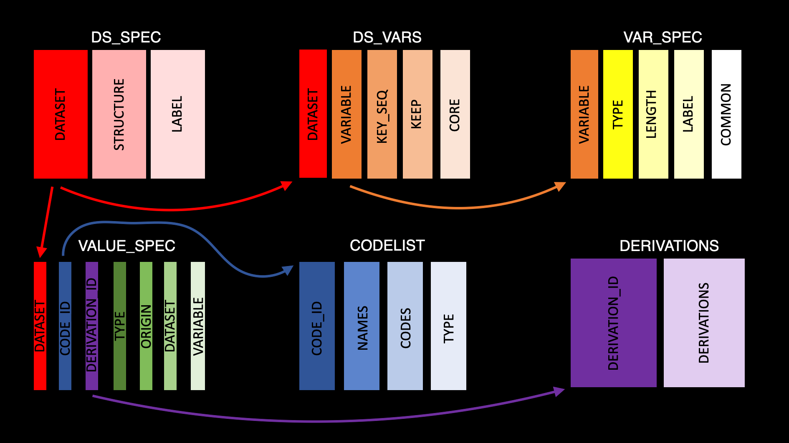

```{r, include = FALSE}
knitr::opts_chunk$set(
  collapse = TRUE,
  comment = "#>"
)
```

```{r setup}
library(metacore)
library(dplyr)
library(purrr)
library(stringr)
```

The first thing to do when trying to build a specification reader is to try the default. By default metacore can read in specification that are in the Pinnacle 21 specification format. If your document isn't in that format, it is still worth trying the default readers, as the error messages can be helpful.

```{r, error=TRUE}
spec_to_metacore(metacore_example("mock_spec.xlsx"))
```

As we can see, the mock spec we are using here doesn't match the format. Therefore we will have to build bespoke reader. Before we start, it is important to understand the structure of the metacore object. Each object acts as its own database for all dataset related metadata. The object has 7 tables, 6 tables holding metadata and 1 change log. The 6 tables and their general purpose are as follows:

-   **ds_sep**: Contains dataset level information

-   **ds_vars**: Bridges the dataset and variable level information

-   **var_spec**: Contains variable level information

-   **value_spec**: Contains value level information

-   **derivations**: Contains all derivations

-   **codelist**: Contains information about code/decodes, permitted values and external libraries

Here is a schema of how all this fits together



ds_spec is connected to ds_vars by the 'dataset' variable and ds_vars is connected to var_spec by the 'variable' variable, etc. For more information on the make-up of metacore objects please see the README. 

Now that we understand what makes a metacore object, we can start to develop the reader.

First, we need to identify what type of specification format you have. At the moment we support a specification where each tab contains information relevant to a different table, such as a domain tab, a variable tab, etc. To test this you can use the `spec_type` function.

```{r}
metacore:::spec_type(metacore_example("mock_spec.xlsx"))
```

Given we have the type style of specification, we can attempt to run with the lower level built-in specification to metacore build. There are 6 lower level specification builders to match each of the 6 datasets needed, spec_type_to\_\*. Even if these fail, the error messages should help identify the issues.

But, before we start any of that, we need to read in our document using the `read_all_sheets` function. This function reads in a multisheet excel file into a named list, where the name of each dataset is the name of the tab. The lower level specification builders do assume the provided `doc` is a named list. This mock specification has 5 tabs, domain, variables, value level metadata, controlled terms, and computational method. So it looks like we might need to split the information in these tabs to get the 6 tables needed for the metacore object.

```{r}
doc <- read_all_sheets(metacore_example("mock_spec.xlsx"))
doc %>% map(head)

```

Let's start with making the ds_spec (dataset specification) table using `spec_type_to_ds_spec`. The ds_spec table is made of 3 columns: the dataset name, the dataset structure, and the dataset label. If we look at our specification document, it looks like all this information is in the Domains tab. Now we know what we need we can start building the table by trying the `spec_type_to_ds_spec` function.

This function takes in our named list of datasets (doc), a named vector of columns (cols) and a sheet name (sheet). But, only doc is needed, the other inputs have defaults. So we can try with just the default and see what we get.

```{r, error=TRUE}
spec_type_to_ds_spec(doc)
```

The error tells us there is an issue with the label column in the Domains table. Meaning, we need to change the default vector for the cols input because the default regular expression isn't specific enough. First, let's check the column names in the Domain tab

```{r}
doc$Domains %>% names()
```

If we look at the default input for cols, `"label" = "[L|l]abel|[D|d]escription"`, we can see the label is matching to the `Label` and the `Description` columns .

We only need the Domain `Name`, `Label`, and `Data Structure` columns. So we can update the expressions to be more specific.

```{r}
ds_spec <- spec_type_to_ds_spec(doc, 
                                cols = c("dataset" = "Name", 
                                         "structure" = "Data Structure",  
                                         "label" = "Label"))
head(ds_spec)
```

Regular expressions are used to match the columns, so if you needed a more flexible input, you could do that. Now, we have the ds_spec table we can move on to the ds_vars table.

The ds_vars table has 5 columns:

-   dataset: dataset name

-   variable: variable name

-   key_seq: integers controlling the sort order of each dataset

-   order: integer controlling the column order of each dataset

-   keep: boolean to determine if the variable is needed

-   core: ADaM core (Expected, Required, Permissible)

-   supp_flag: boolean to determine if the variable is in the supplementals

When we look back at our specification document we can see all this information is in the variable tab. The inputs for the `spec_type_to_ds_vars` function are the same as before, but with slightly different defaults. By default ds_vars only checks sheets labeled "Variable" (this is because all the settings are defaulted to read in P21 formatted specs). But, those default work for our specifications cause all the information is in the variable tab; so we can try with just the defaults again.

```{r, error=TRUE}
spec_type_to_ds_vars(doc)
```

This error means it is trying to match the sheet entitled Variable, the variable column matches to two different columns. This is the same error we had before. We just need to have a quick look at the columns and adjust the regular expression to be more specific. Additionally, for the key sequence variable isn't in the variable tab. We saw this information above in the domain tab. So we will need to do two things to fix this. First, adjust the dataset name in the `key_seq_cols` argument. Second, change the sheets to include the variable and the domain sheet. 

```{r}
doc$Variables %>% head()

ds_vars<- spec_type_to_ds_vars(doc, cols = c("dataset" = "Domain",
                                               "variable" = "[V|v]ariable [N|n]ame",
                                               "order" = "[V|v]ariable [O|o]rder",
                                               "keep" = "[M|m]andatory"),
                               key_seq_cols = c("dataset" = "Domain Name",
                                                "key_seq" = "Key"),
                               sheet = "[V|v]ar|Domains") 
   
head(ds_vars)
```

The next table we have is var_spec, the table of variable level metadata. var_spec is separate from ds_vars because, in accordance with CDISC standards, labels and lengths should be the same for a given variable across all datasets. So, we are able to normalize the data to only have one row per variable, which ensures this rule and helps reduce the size of the object. There are 6 columns in var_spec:

-   variable: variable name

-   length: variable length

-   label: variable label

-   type: variable Class

-   format: variable format

-   common: boolean if variable is common across ADaM

Looking back at our specification we see this will also be built using the Variable tab. So, we know we need to edit the regular expression for the variable to make it more specific. Additionally, if you look at the default for `cols` you see there is a dataset input. This is because some standards aren't 100% consistent, some variables (e.g. visit) have different lengths depending on the dataset. **So to accommodate this some of the variables in var_spec are in the ds.variable format**. These builders will do this conversion for you , but the dataset is needed. The other thing the builders can automatically deal with is the common variable. If given a dataset column, the builder function will automatically figure out which variables are common to all dataset. This is good because we don't have a common variable in our specs.

```{r}
var_spec <- spec_type_to_var_spec(doc, cols = c("variable" = "Variable Name",
                                                "length" = "[L|l]ength",
                                                "label" = "[L|l]abel",
                                                "type" = "[T|t]ype",
                                                "dataset" = "[D|d]ataset|[D|d]omain",
                                                "format" = "Format"))
head(var_spec)
```

There is one issue here: the format column is also the codelist names. This is because the information came from the "Controlled Term or Format" column of my spec document. So the final step of preparing var_spec table is to remove the controlled terms. It is easy here because all the formats end in a full stop (.), but the controlled terms don't.

```{r}
var_spec <- var_spec %>% 
   mutate(format = if_else(str_detect(format, "\\."), format, ""))
```

The next dataset is value_spec, which contains the value level metadata. It is made up of 7 columns:

-   dataset: dataset name

-   variable: variable name

-   origin: origin of data

-   type: value type

-   code_id: id used to cross-reference the code/decode

-   where: value of the variable

-   derivation_id: id used to cross-reference the derivation

By default, `spec_type_to_value_spec` is set up to have the where information on different sheet because that is the format of a P21 spec, but in our spec we don't have that. In fact, we don't have any value level metadata in our spec. But, that is fine - the default builders will just pull what information it can from the variable tab.

```{r}
value_spec <- spec_type_to_value_spec(doc, cols = c("dataset" = "VLM Name|Domain",
                                                  "variable" = "VLM Name|Variable Name",
                                                  "origin" = "[O|o]rigin",
                                                  "type" = "[T|t]ype",
                                                  "code_id" = "Controlled Term",
                                                  "where" = "Parameter Code",
                                                  "derivation_id" = "Method"),
                                    where_sep_sheet = FALSE)
head(value_spec)
```

The derivation table is relatively simple by comparison. It just has two columns, the derivation id and the derivation. The derivation id should match the derivation id in the the value spec table.

```{r}
derivation <- spec_type_to_derivations(doc, cols = c("derivation_id" = "Name",
                                                   "derivation" = "[D|d]efinition|[D|d]escription")) 
head(derivation)
```

The final table is codelist. This table contains all the code/decode pairs, all lists of permitted values and information about external libraries. What is somewhat special about the structure of this table is there isn't just a code and a decode column, but rather a codes column that contains a list of code/decode tables, permitted value vectors and external dictionary vectors. So there is one row per code (i.e. a row for country and one for yes/no codes etc.). This structure makes it easier to see all the codes at once and allows some code to be numeric and others to be character.

By default the `spec_type_to_codelist` function expects codelists and external dictionaries. But, in the specification we only have codelist so `dict_cols` needs to be set to null.

```{r}
codelist <- spec_type_to_codelist(doc, codelist_cols = c("code_id" = "Codelist Code",
                                                          "name" = "Codelist Name",
                                                          "code" = "Coded Value",
                                                          "decode" = "Decoded Value"),
                      dict_cols = NULL)
head(codelist)
```

Now we have all the tables we need we can make the metacore object

```{r}
metacore(ds_spec, ds_vars, var_spec, value_spec,
               derivation, codelist)
```

And we're good to go! 
